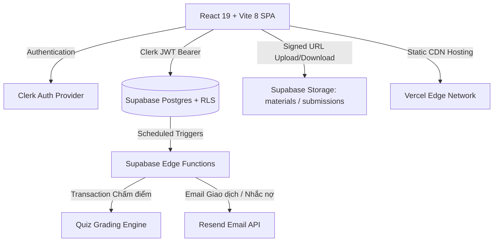

# 🎓 Learn Mate — Sổ Gia Sư & Quản Lý Lớp Học Thông Minh

<div align="center">


**Nền tảng quản lý lớp học và giảng dạy trực tuyến tinh gọn dành riêng cho Gia sư, Giáo viên và Trung tâm dạy thêm.**

*Every student. Every class. One Learn-Mate.*

---

[](https://react.dev/)
[](https://vitejs.dev/)
[](https://supabase.com/)
[](https://clerk.com/)
[](#)
[](#)

</div>

---

## 📌 Mục Lục
- [1. Giới thiệu Dự án](#1-giới-thiệu-dự-án)
- [2. Tính năng Nổi bật](#2-tính-năng-nổi-bật)
  - [Dành cho Gia Sư (Tutor)](#-dành-cho-gia-sư-tutor)
  - [Dành cho Học Sinh (Student)](#-dành-cho-học-sinh-student)
  - [Dành cho Quản Trị Viên (Admin)](#-dành-cho-quản-trị-viên-admin)
- [3. Kiến trúc Công nghệ & Bảo mật](#3-kiến-trúc-công-nghệ--bảo-mật)
- [4. Cấu trúc Thư mục Dự án](#4-cấu-trúc-thư-mục-dự-án)
- [5. Hướng dẫn Cài đặt & Chạy Local](#5-hướng-dẫn-cài-đặt--chạy-local)
- [6. Cấu hình Biến Môi Trường (.env)](#6-cấu-hình-biến-môi-trường-env)
- [7. Hướng dẫn Triển khai (Deployment)](#7-hướng-dẫn-triển-khai-deployment)
- [8. Quy ước Kỹ thuật Cốt lõi](#8-quy-ước-kỹ-thuật-cốt-lõi)
- [9. Đóng góp & Giấy phép](#9-đóng-góp--giấy-phép)

---

## 1. Giới thiệu Dự án

**Learn-Mate** là giải pháp LMS (Learning Management System) hiện đại được thiết kế theo triết lý **"Sổ Gia Sư Điện Tử"**. Khác với các hệ thống quản trị trường học cồng kềnh, Learn-Mate tập trung giải quyết chính xác các vấn đề nhức nhối hàng ngày của gia sư và lớp học kèm:

* 🎯 **Quản lý học sinh & sĩ số**: Tự động hóa việc gia nhập lớp qua mã ngắn, theo dõi chuyên cần và biểu đồ học lực.
* 📚 **Kho bài giảng số hóa**: Tổ chức bài giảng video kèm cơ chế tracking % thời lượng xem thực tế, chia sẻ tài liệu học tập bảo mật.
* 🧠 **Ngân hàng đề thi & Chấm điểm tự động**: Hỗ trợ 5 loại câu hỏi, tích hợp công cụ Import đề thi từ AI (ChatGPT/Claude/Gemini) với chi phí $0 API credit.
* 📅 **Lịch dạy tuần & Điểm danh 1 chạm**: Thời khóa biểu trực quan, tích hợp phòng học Zoom/Meet, điểm danh 4 trạng thái nhanh chóng.
* 💰 **Sổ học phí minh bạch**: Tự động sinh hóa đơn, thống kê thu/nợ quá hạn và gửi email nhắc tự động qua Resend.
* ⚡ **Quy mô & Chi phí**: Thiết kế tối ưu hóa Free-tier cho quy mô **~500 học sinh** với chi phí vận hành **$0/tháng**.

---

## 2. Tính năng Nổi bật

### 👨‍🏫 Dành cho Gia Sư (Tutor)
* **Dashboard "Sổ Gia Sư"**: Bố cục 4 khối trung tâm thông minh:
  * *Buổi dạy sắp tới (24h)* kèm nút vào phòng học Zoom/Meet.
  * *Lớp chưa điểm danh* nhắc nhở điểm danh sau buổi học.
  * *Bài tập cần chấm* liệt kê bài nộp mới của học sinh.
  * *Học phí chưa thu* theo dõi các khoản nợ học phí quá hạn.
* **Quản lý Lớp học**: Tạo lớp, cấp/thu hồi `class_code`, mời/xóa học sinh ra khỏi lớp an toàn.
* **Khóa học & Bài giảng**: Cấu trúc 3 cấp (*Khóa học → Chương → Bài học*), nhúng video YouTube với YouTube Iframe API tracking thời lượng xem, upload tài liệu PDF/Word vào Supabase Storage bucket `materials`.
* **Đề thi & Ngân hàng câu hỏi**:
  * 5 định dạng câu hỏi: *Trắc nghiệm 1 đáp án, Trắc nghiệm nhiều đáp án, Đúng/Sai, Điền khuyết, Tự luận*.
  * **Import trắc nghiệm bằng AI bên ngoài**: Tích hợp Prompt mẫu 1-click cho AI, Parser & Zod validator 2 tầng, UI sửa lỗi inline và Postgres Transaction Batch RPC an toàn.
  * Cấu hình đề kiểm tra: Đếm ngược thời gian, xáo trộn câu hỏi & đáp án, giới hạn số lượt làm bài và ngưỡng điểm đạt.
* **Bài tập về nhà**: Giao bài kèm đề đính kèm của giáo viên, xem file bài làm học sinh nộp (bucket `submissions`), chấm điểm thang 10 kèm nhận xét chi tiết.
* **Lịch dạy & Điểm danh**: Lưới Thời khóa biểu Tuần (Weekly Timetable), Mini Calendar đồng bộ, tạo lịch lặp lại hàng tuần, điểm danh 4 trạng thái (*Có mặt, Đi trễ, Có phép, Vắng*).
* **Quản lý Học phí & Báo cáo**: Sinh hóa đơn hàng loạt theo kỳ, ghi nhận thanh toán 1 chạm, và xuất toàn bộ báo cáo (*Danh sách lớp, Bảng điểm, Lịch sử chuyên cần*) ra file Excel `.xlsx`.

---

### 🎒 Dành cho Học Sinh (Student)
* **Dashboard "Góc Học Tập"**: Tổng hợp lịch học trực tuyến tiếp theo, danh sách bài tập sắp đến hạn, điểm kiểm tra mới nhất và hóa đơn học phí cá nhân.
* **Vào lớp 1 chạm**: Nhập mã `class_code` để ghi danh vào lớp học ngay lập tức.
* **Phòng học trực tuyến**: Xem video bài giảng (tự động đánh dấu hoàn thành khi xem ≥ 90%), tải tài liệu và file đề bài đính kèm của thầy cô.
* **Làm bài kiểm tra Online**: Giao diện phòng thi trực tuyến có đồng hồ đếm ngược, điều hướng nhanh danh sách câu hỏi, nộp bài an toàn và xem lời giải giải thích sau khi hoàn tất.
* **Nộp bài tập**: Tải file bài làm PDF/Word/Zip lên hệ thống, theo dõi điểm số và nhận xét phản hồi từ gia sư.
* **Nâng cấp tài khoản**: Nộp đơn đăng ký trở thành Gia sư (`tutor_applications`) ngay trên giao diện.

---

### ⚙️ Dành cho Quản Trị Viên (Admin)
* **Xét duyệt Đơn Gia sư**: Màn hình xem xét thông tin, hồ sơ kinh nghiệm và duyệt/từ chối đơn đăng ký làm gia sư của học sinh.
* **Quản lý Người dùng**: Xem danh sách người dùng toàn hệ thống, tìm kiếm, chỉnh sửa thông tin, phân quyền nhanh (*Admin / Gia sư / Học sinh*), khóa hoặc mở khóa tài khoản.
* **Role Switcher (Chế độ Xem thử)**: Chuyển đổi giao diện nhanh giữa 3 vai trò trực tiếp trên Header để kiểm thử luồng người dùng thuận tiện.

---

## 3. Kiến trúc Công nghệ & Bảo mật



### Stack Công nghệ Chi tiết
| Tầng | Công nghệ | Chi tiết sử dụng |
|---|---|---|
| **Frontend Framework** | React 19 + Vite 8 | Tối ưu thời gian HMR và build production siêu tốc (~350ms) |
| **Styling** | Vanilla CSS + Design System | Tinh chỉnh theo `design-taste-frontend`, Dark/Light Mode, Glassmorphism, Micro-animations |
| **Xác thực (Auth)** | Clerk Auth | UI Đăng nhập/Đăng ký Double Slider, Google OAuth, Clerk JWT template tích hợp Supabase |
| **Cơ sở dữ liệu** | Supabase (PostgreSQL) | Bật Row Level Security (RLS) trên 100% bảng qua hàm `requesting_user_id()` |
| **Lưu trữ File** | Supabase Storage | Bucket `materials` (tài liệu/đề bài) & Bucket `submissions` (bài nộp học sinh) |
| **Backend Không máy chủ** | Supabase Edge Functions | Chấm điểm quiz server-side (`submit-quiz-attempt`), Clerk webhook, Cron nhắc lịch/học phí |
| **Dịch vụ Email** | Resend API | Gửi email thông báo lịch học và nhắc hạn nộp học phí định kỳ |
| **Xử lý Dữ liệu** | Zod + PapaParse + SheetJS (xlsx) | Validate file JSON/CSV câu hỏi AI & Xuất báo cáo Excel on-demand |

### 🔒 Các Cơ chế Bảo mật & Hiệu năng Nổi bật
1. **Chống Gian lận Đề thi (Anti-Cheat Quiz)**: Học sinh không thể đọc trực tiếp trường `answer_options.is_correct`. Đề thi được lấy qua Edge Function đã lược bỏ đáp án đúng; toàn bộ logic chấm điểm diễn ra ở server.
2. **Batch Insert Nguyên tử (Atomic Transaction)**: Import hàng chục câu hỏi cùng lúc qua PostgreSQL Function `insert_quiz_questions_batch` với `SECURITY DEFINER`, tự rollback nếu có lỗi nhằm tránh rác DB.
3. **Tối ưu Hiệu năng P0 → P3**:
   * Chuyển đổi 20+ routes sang `React.lazy()` + `<Suspense>`, tách `xlsx`, `zod`, `papaparse` vào manual chunks riêng. Kích thước entry bundle giảm 97.5% (từ 1.08 MB xuống 27 kB).
   * Loại bỏ nút thắt Waterfall bằng cách truy vấn song song dữ liệu qua `Promise.all` (giảm thời gian tải Dashboard từ ~1.2s xuống ~200ms).
   * Tích hợp Shimmer Skeleton loaders và ErrorBoundary toàn cục chống crash màn hình trắng.

---

## 4. Cấu trúc Thư mục Dự án

```
learn-mate/
├── public/
│   ├── favicon.svg             # Favicon thương hiệu Learn Mate
│   └── logo.svg                # Logo vector SVG chính thức
├── src/
│   ├── components/
│   │   ├── common/             # Logo, SkeletonLoader, ErrorBoundary, PageLoadingFallback
│   │   ├── course/             # CourseCard, LessonList, YoutubeEmbed, LessonContentEditor
│   │   ├── layout/             # Header, Sidebar (Mobile Off-canvas Drawer)
│   │   ├── notifications/      # NotificationBell, Popover Realtime
│   │   ├── quiz/               # QuestionEditorModal, QuizBuilderModal, ImportQuizModal, ImportReviewStep
│   │   └── schedule/           # WeeklyTimetable, MiniCalendar, CreateScheduleModal, ScheduleDetailModal
│   ├── context/
│   │   └── AuthContext.jsx     # Quản lý phiên Clerk & đồng bộ vai trò Supabase Profiles
│   ├── lib/
│   │   ├── clerk.js            # Cấu hình Clerk Auth
│   │   ├── excelExport.js      # Module xuất báo cáo Excel (Lazy Import)
│   │   ├── formatters.js       # Format tiền tệ, ngày giờ chuẩn tiếng Việt
│   │   ├── importQuizParser.js # Parser & Zod validator file trắc nghiệm AI
│   │   ├── storage.js          # Tiện ích Upload/Signed URL Supabase Storage
│   │   └── supabaseClient.js   # Khởi tạo Supabase client gắn Clerk Bearer Token
│   ├── pages/
│   │   ├── admin/              # AdminDashboard, AdminUsers, AdminApplications
│   │   ├── auth/               # AuthPage (Modern Double Slider Sign In / Sign Up)
│   │   ├── student/            # StudentDashboard, StudentClasses, StudentCourseView, StudentQuizTake, StudentAssignments, StudentSchedules, StudentTuition
│   │   ├── teacher/            # TeacherDashboard, TeacherClasses, TeacherCourses, CourseDetail, TeacherQuizzes, TeacherAssignments, TeacherStudents, TeacherSchedules, TeacherTuition
│   │   └── LandingPage.jsx     # Trang giới thiệu ứng dụng
│   ├── routes/
│   │   ├── AppRouter.jsx       # Lazy loading router & Suspense fallback
│   │   └── ProtectedRoute.jsx  # Route guard kiểm tra đăng nhập & phân quyền vai trò
│   ├── App.jsx
│   ├── index.css               # Hệ thống Design tokens, Utilities, Shimmer Animation
│   └── main.jsx
├── supabase/
│   ├── functions/              # Supabase Edge Functions (Deno / TypeScript)
│   │   ├── clerk-webhook/
│   │   ├── get-quiz-for-attempt/
│   │   ├── submit-quiz-attempt/
│   │   ├── generate-tuition-invoices/
│   │   └── send-reminder-emails/
│   └── migrations/             # Các bản migration SQL theo từng giai đoạn
│       ├── 01_initial_schema.sql
│       ├── 02_add_class_code.sql
│       ├── 03_fix_profiles_rls.sql
│       └── 04_insert_quiz_batch_fn.sql
├── package.json
├── vercel.json                 # Cấu hình SPA routing & HTTP Caching headers
└── vite.config.js              # Cấu hình Vite 8 / Rolldown manual chunks
```

---

## 5. Hướng dẫn Cài đặt & Chạy Local

### Yêu cầu Tiên quyết
* **Node.js**: Phiên bản 18.0.0 trở lên.
* **Tài khoản Supabase**: Tạo project mới tại [supabase.com](https://supabase.com).
* **Tài khoản Clerk**: Tạo application mới tại [clerk.com](https://clerk.com).

### Các bước Cài đặt
1. **Clone repository về máy**:
   ```bash
   git clone https://github.com/your-username/learn-mate.git
   cd learn-mate
   ```

2. **Cài đặt các gói phụ thuộc (Dependencies)**:
   ```bash
   npm install
   ```

3. **Cấu hình Database Supabase**:
   * Truy cập mục **SQL Editor** trên Dashboard của Supabase project.
   * Lần lượt chạy nội dung các file SQL trong thư mục `supabase/migrations/`:
     1. `01_initial_schema.sql` (Tạo bảng, ENUMs, Indexes, RLS và Helper Functions).
     2. `02_add_class_code.sql` (Cấu hình mã lớp học & hàm `join_class_by_code`).
     3. `03_fix_profiles_rls.sql` (Tối ưu chính sách RLS cho danh sách học sinh).
     4. `04_insert_quiz_batch_fn.sql` (Postgres RPC transaction import quiz).
   * Tạo 2 Storage Buckets (chế độ Private):
     * `materials`: Dùng lưu tài liệu bài học và file đề bài của gia sư.
     * `submissions`: Dùng lưu bài làm nộp của học sinh.

4. **Cấu hình Clerk Auth JWT Template**:
   * Trong Clerk Dashboard: Vào **JWT Templates** → Tạo template mới tên là `supabase`.
   * Thêm claim `"role": "{{user.public_metadata.role}}"` và ký bằng **Supabase JWT Secret**.

5. **Tạo file cấu hình môi trường `.env`**:
   * Tạo file `.env` tại thư mục gốc dự án theo mẫu bên dưới.

6. **Khởi chạy ứng dụng ở chế độ Development**:
   ```bash
   npm run dev
   ```
   * Mở trình duyệt và truy cập `http://localhost:5173`.

---

## 6. Cấu hình Biến Môi Trường (.env)

Tạo file `.env` tại thư mục gốc với các thông số:

```env
# Clerk Authentication
VITE_CLERK_PUBLISHABLE_KEY=pk_test_your_clerk_publishable_key_here

# Supabase Backend
VITE_SUPABASE_URL=https://your-project-id.supabase.co
VITE_SUPABASE_ANON_KEY=eyJhbGciOi...your_supabase_anon_key_here
```

---

## 7. Hướng dẫn Triển khai (Deployment)

### Triển khai Frontend lên Vercel
1. Đẩy mã nguồn lên repository GitHub.
2. Đăng nhập [Vercel](https://vercel.com) → Chọn **Add New Project** → Import repository `learn-mate`.
3. Cấu hình **Environment Variables** trên Vercel tương tự file `.env`.
4. Dự án đã có sẵn file vercel.json tự động xử lý Single Page Application (SPA) routing và cache assets `immutable` 1 năm. Bấm **Deploy**.

### Triển khai Supabase Edge Functions
Sử dụng Supabase CLI để deploy các Edge Functions:
```bash
# Đăng nhập Supabase CLI
npx supabase login

# Link tới project Supabase
npx supabase link --project-ref your-project-id

# Deploy toàn bộ Edge Functions
npx supabase functions deploy clerk-webhook
npx supabase functions deploy get-quiz-for-attempt
npx supabase functions deploy submit-quiz-attempt
npx supabase functions deploy generate-tuition-invoices
npx supabase functions deploy send-reminder-emails
```

---

## 8. Quy ước Kỹ thuật Cốt lõi

Để đảm bảo hệ thống vận hành ổn định và bảo mật:
1. **User ID là `TEXT`**: Vì Clerk là nguồn xác thực chính, mọi khóa ngoại liên kết tới người dùng trong Database đều có kiểu dữ liệu `TEXT` (dạng `user_2...`), **không dùng `UUID`**.
2. **Bắt buộc Row Level Security (RLS)**: Mọi bảng chứa dữ liệu người dùng đều phải bật RLS và truy vấn quyền thông qua hàm `requesting_user_id()`.
3. **Bảo tồn Storage**: Video bài giảng luôn nhúng qua URL YouTube (không lưu trữ file video trực tiếp trên Storage).
4. **Server-Side Grading**: Toàn bộ quy trình chấm bài thi trắc nghiệm diễn ra trong môi trường an toàn trên Edge Function.
5. **No AI API Credit Waste**: Tận dụng tối đa AI bên ngoài thông qua chuẩn file JSON/CSV chuẩn hóa, loại bỏ hoàn toàn chi phí gọi API LLM trực tiếp.

---

## 9. Đóng góp & Giấy phép

Dự án được phân phối dưới giấy phép **MIT License**. Mọi đóng góp, báo lỗi (Issue) hoặc đề xuất tính năng (Pull Request) đều được hoan nghênh.

<div align="center">

Được phát triển với sự tận tâm dành cho cộng đồng Giáo viên & Gia sư Việt Nam 🇻🇳

**[Learn Mate — Every student. Every class. One Learn-Mate.]**

</div>
